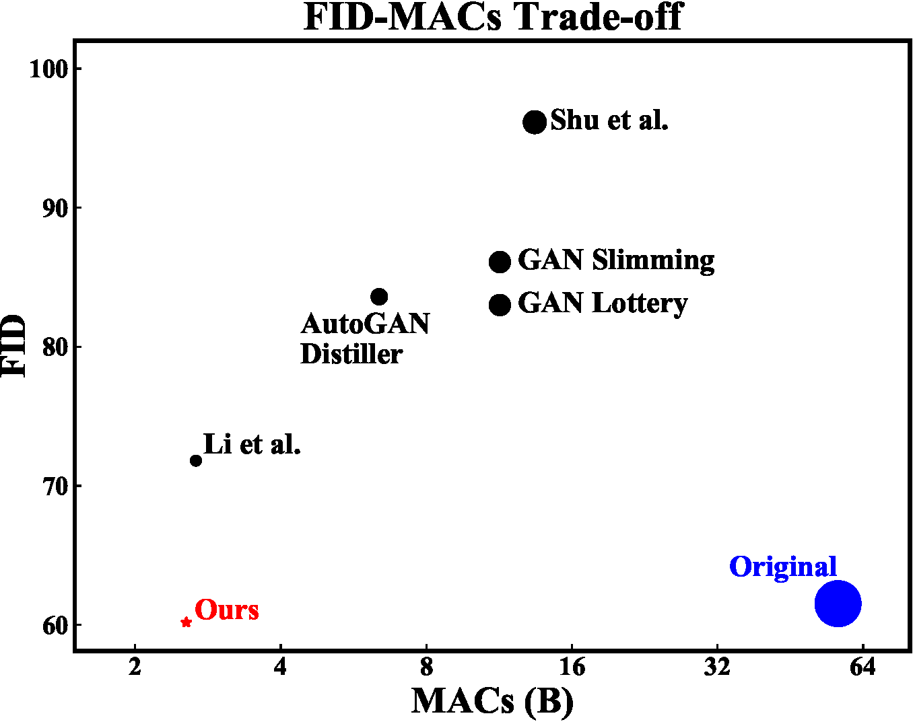

# CAT
[CVPR](https://openaccess.thecvf.com/content/CVPR2021/html/Jin_Teachers_Do_More_Than_Teach_Compressing_Image-to-Image_Models_CVPR_2021_paper.html) | [arXiv](https://arxiv.org/abs/2103.03467) | [website](https://dejqk.github.io/GAN_CAT) | [Tutorial (Image-to-Image)](https://lensstudio.snapchat.com/guides/machine-learning/lens-templates/) (Our method can be used in mobile devices!)

<table cellpadding="0" cellspacing="0" >
  <tr>
    <td  align="center">Input<br> </td>
    <td  align="center">Night<br> </td>
    <td  align="center">Style<br> </td>
    <td  align="center">Anime<br> </td>
  </tr>
</table>


<p align="center">
  
</p>

Pytorch implementation of our method for compressing image-to-image models. <br>
[Teachers Do More Than Teach: Compressing Image-to-Image Models](https://arxiv.org/abs/2103.03467)  
[Qing Jin](https://scholar.google.com/citations?user=X9iggBcAAAAJ&hl=zh-CN)<sup>1</sup>, [Jian Ren](https://alanspike.github.io/)<sup>2</sup>, [Oliver J. Woodford](https://scholar.google.com/citations?user=6czTBiUAAAAJ&hl=en), [Jiazhuo Wang](https://www.linkedin.com/in/jiazhuo-wang-065624102)<sup>2</sup>, [Geng Yuan](https://scholar.google.com/citations?user=tBIAgtgAAAAJ)<sup>1</sup>, [Yanzhi Wang](https://coe.northeastern.edu/people/wang-yanzhi/)<sup>1</sup>, [Sergey Tulyakov](http://www.stulyakov.com/)<sup>2</sup>  
<sup>1</sup>Northeastern University, <sup>2</sup>Snap Inc. <br>
In CVPR 2021.  

## Overview

Compression And Teaching (CAT) framework for compressing image-to-image models: ① Given a pre-trained teacher generator Gt, we determine the architecture of a compressed student generator Gs by eliminating those channels with smallest magnitudes of batch norm scaling factors. ② We then distill knowledge from the pretrained teacher Gt on the student Gs via a novel distillation technique, which maximize the similarity between features of both generators, defined in terms of kernel alignment (KA).


## Prerequisites

* Linux
* Python 3
* CPU or NVIDIA GPU + CUDA CuDNN

## Getting Started

### Installation

- Clone this repo:

  ```shell
  git clone git@github.com:snap-research/CAT.git
  cd CAT
  ```

- Install [PyTorch](https://pytorch.org) 1.7 and other dependencies (e.g., torchvision).

  - For pip users, please type the command `pip install -r requirements.txt`.
  - For Conda users, please create a new Conda environment using `conda env create -f environment.yml`.

## Data Preparation

### CycleGAN

#### Setup

* Download the CycleGAN dataset (e.g., horse2zebra).

  ```shell
  bash datasets/download_cyclegan_dataset.sh horse2zebra
  ```

* Get the statistical information for the ground-truth images for your dataset to compute FID. We provide pre-prepared real statistic information for several datasets on [Google Drive Folder](https://drive.google.com/drive/folders/1kSH8vPuO6i_oAMzi3V6aVox3UQCtYIiB?usp=sharing).

### Pix2pix

#### Setup

* Download the pix2pix dataset (e.g., cityscapes).

  ```shell
  bash datasets/download_pix2pix_dataset.sh cityscapes
  ```

### Cityscapes Dataset

For the Cityscapes dataset, we cannot provide it due to license issue. Please download the dataset from https://cityscapes-dataset.com and use the script [prepare_cityscapes_dataset.py](datasets/prepare_cityscapes_dataset.py) to preprocess it. You need to download `gtFine_trainvaltest.zip` and `leftImg8bit_trainvaltest.zip` and unzip them in the same folder. For example, you may put `gtFine` and `leftImg8bit` in `database/cityscapes-origin`. You need to prepare the dataset with the following commands:

```shell
python datasets/get_trainIds.py database/cityscapes-origin/gtFine/
python datasets/prepare_cityscapes_dataset.py \
--gtFine_dir database/cityscapes-origin/gtFine \
--leftImg8bit_dir database/cityscapes-origin/leftImg8bit \
--output_dir database/cityscapes \
--table_path datasets/table.txt
```

You will get a preprocessed dataset in `database/cityscapes` and a mapping table (used to compute mIoU) in `dataset/table.txt`.

* Get the statistical information for the ground-truth images for your dataset to compute FID. We provide pre-prepared real statistics for several datasets. For example,

  ```shell
  bash datasets/download_real_stat.sh cityscapes A
  ```


## Evaluation Preparation

### mIoU Computation

To support mIoU computation, you need to download a pre-trained DRN model `drn-d-105_ms_cityscapes.pth` from http://go.yf.io/drn-cityscapes-models. By default, we put the drn model in the root directory of our repo. Then you can test our compressed models on cityscapes after you have downloaded our compressed models.

### FID/KID Computation

To compute the FID/KID score, you need to get some statistical information from the groud-truth images of your dataset. We provide a script [get_real_stat.py](./get_real_stat.py) to extract statistical information. For example, for the map2arial dataset, you could run the following command:

  ```shell
python get_real_stat.py \
--dataroot database/map2arial \
--output_path real_stat/maps_B.npz \
--direction AtoB
  ```

For paired image-to-image translation (pix2pix and GauGAN), we calculate the FID between generated test images to real test images. For unpaired image-to-image translation (CycleGAN), we calculate the FID between generated test images to real training+test images. This allows us to use more images for a stable FID evaluation, as done in previous unconditional GANs research. The difference of the two protocols is small. The FID of our compressed CycleGAN model increases by 4 when using real test images instead of real training+test images.

KID is not supported for the cityscapes dataset.


## Model Training

### Teacher Training
The first step of our framework is to train a teacher model. For this purpose, please run the script `train_inception_teacher.sh` under the correponding folder named as the dataset, for example, run 
```shell 
bash scripts/cycle_gan/horse2zebra/train_inception_teacher.sh
```

### Student Training
With the pretrained teacher model, we can determine the architecture of student model under prescribed computational budget. For this purpose, please run the script `train_inception_student_XXX.sh` under the correponding folder named as the dataset, where `XXX` stands for the computational budget (in terms of FLOPs for this case) and can be different for different datasets and models. For example, for CycleGAN with Horse2Zebra dataset, our computational budget is 2.6B FLOPs, so we run 
```shell
bash scripts/cycle_gan/horse2zebra/train_inception_student_2p6B.sh
```

### Pre-trained Models
For convenience, we also provide pretrained teacher and student models on [Google Drive Folder](https://drive.google.com/drive/folders/1WQbqgqwJdVT6Q-8Bs-vp24jJ3v1dgjU9?usp=sharing).

## Model Evaluation
With pretrained teacher and student models, we can evaluate them on the dataset. For this purpose, please run the script `evaluate_inception_student_XXX.sh` under the corresponding folder named as the dataset, where `XXX` is the computational budget (in terms of FLOPs). For example, for CycleGAN with Horse2Zebra dataset where the computational budget is 2.6B FLOPs, please run 
```shell 
bash scripts/cycle_gan/horse2zebra/evaluate_inception_student_2p6B.sh
```

## Model Export
The final step is to export the trained compressed model as onnx file to run on mobile devices. For this purpose, please run the script `onnx_export_inception_student_XXX.sh` under the corresponding folder named as the dataset, where `XXX` is the computational budget (in terms of FLOPs). For example, for CycleGAN with Horse2Zebra dataset where the computational budget is 2.6B FLOPs, please run 
```shell
bash scripts/cycle_gan/horse2zebra/onnx_export_inception_student_2p6B.sh
```
This will create one .onnx file in addition to log files. 

## Citation

If you use this code for your research, please cite our [paper](https://arxiv.org/abs/2103.03467).
```
@inproceedings{jin2021teachers,
  title={Teachers Do More Than Teach: Compressing Image-to-Image Models},
  author={Jin, Qing and Ren, Jian and Woodford, Oliver J and Wang, Jiazhuo and Yuan, Geng and Wang, Yanzhi and Tulyakov, Sergey},
  booktitle={Proceedings of the IEEE/CVF Conference on Computer Vision and Pattern Recognition},
  pages={13600--13611},
  year={2021}
}
```


## Acknowledgements

Our code is developed based on [AtomNAS](https://github.com/meijieru/AtomNAS) and [gan-compression](https://github.com/mit-han-lab/gan-compression).

We also thank [pytorch-fid](https://github.com/mseitzer/pytorch-fid) for FID computation and [drn](https://github.com/fyu/drn) for mIoU computation.
